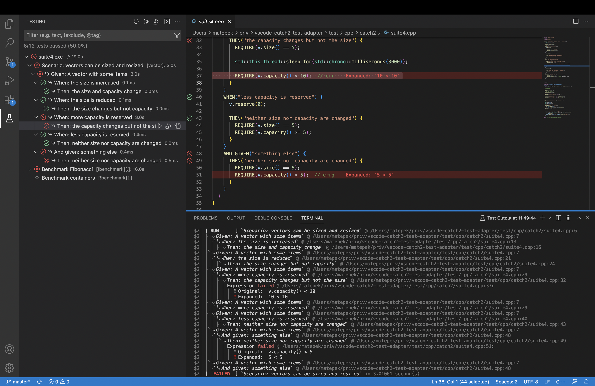

# C++ TestMate

## A **Catch2**, **GoogleTest**, **doctest** and **GoogleBenchmark** Explorer for VSCode

This extension allows you to run your
[Catch2](https://github.com/catchorg/Catch2),
[Google Test](https://github.com/google/googletest)
and [DOCtest](https://github.com/onqtam/doctest)
tests using the native testing vscode-api.
It also have basic support for [Google Benchmark](https://github.com/google/benchmark).

## Features / Show-Off

The previous version (v3.x.y) of the extension is published as [C++ TestMate Legacy](https://github.com/matepek/vscode-catch2-test-adapter/tree/legacy)
in case this is too buggy or you cannot wait for some old feature.

- New testing API integration has just happened with a tons of improvements.
  - Streaming the test run: Don't have to wait for the result to see the progress (in case you test uses `std::cout`)
  - Catch Section and DOCTest SubCase support (limited but still sometings)
- Runs executables parallel (_testMate.cpp.test.parallelExecutionLimit_).
- Sorts tests and suites (_testExplorer.sort_).
- Supports popular **debuggers** such as `vadimcn.vscode-lldb`, `webfreak.debug` and `ms-vscode.cpptools` out of the box.

### Missing features (coming in the future if possible):

- Retire tests and "Autorun" them.

### Screenshots

### More features

- One executable can be run parallel with distinct set of subtests to boost runtime.
- Finds and recognises the executables by a given [glob pattern](https://code.visualstudio.com/docs/editor/codebasics#_advanced-search-options). ([More](#catch2TestExplorer_executables))
- Automatically runs executables if it is modified ("_..._" -> "_Enable autorun_") or if a dependency is modified (`dependsOn`)
- Grouping can be fully customized. ([Details](https://github.com/matepek/vscode-catch2-test-adapter/blob/master/documents/configuration/test.advancedExecutables.md#testgrouping))
- and many more.. Ask on [gitter](https://gitter.im/CppTestMate/community?utm_source=badge&utm_medium=badge&utm_campaign=pr-badge).

## [Configuration](https://github.com/matepek/vscode-catch2-test-adapter/tree/master/documents/configuration)

[settings.json]: https://code.visualstudio.com/docs/getstarted/settings
[test.advancedexecutables]: https://github.com/matepek/vscode-catch2-test-adapter/blob/master/documents/configuration/test.advancedExecutables.md
[debug.configtemplate]: https://github.com/matepek/vscode-catch2-test-adapter/blob/master/documents/configuration/debug.configTemplate.md

The extension is \*_pre-configured_ and it should find executables inside the working directory which match the following [_glob pattern_](https://code.visualstudio.com/docs/editor/codebasics#_advanced-search-options):
Not good enough for you?!: Edit your `.vscode/`[settings.json] file according to the [test.advancedExecutables]!

| `testMate.cpp.___`                        | Description                                                                                                                                                                                                                                                                                                                                                                                                                                                                                   |
| ----------------------------------------- | --------------------------------------------------------------------------------------------------------------------------------------------------------------------------------------------------------------------------------------------------------------------------------------------------------------------------------------------------------------------------------------------------------------------------------------------------------------------------------------------- |
| `test.executables`                        | A [glob pattern](https://code.visualstudio.com/docs/editor/codebasics#_advanced-search-options) to find test executables. (Relative to the workspace folder or absolute path.) Empty string means disabled. For more option set [testMate.cpp.test.advancedExecutables](https://github.com/matepek/vscode-catch2-test-adapter/blob/master/documents/configuration/test.advancedExecutables.md) instead of this. NOTE: if `testMate.cpp.test.advancedExecutables` is set then this is ignored. |
| [test.advancedExecutables]                | Array of executables with a lot of options. (If this is set then `testMate.cpp.test.executables` is ignored.) ([Details](https://github.com/matepek/vscode-catch2-test-adapter/blob/master/documents/configuration/test.advancedExecutables.md)).                                                                                                                                                                                                                                             |
| `test.workingDirectory`                   | Sets the working directory of the test executable (relative to the workspace folder or absolute path). Note: `testMate.cpp.advancedExecutables` overwrites it locally. ([Variables](https://github.com/matepek/vscode-catch2-test-adapter/blob/master/documents/configuration/test.advancedExecutables.md#variables))                                                                                                                                                                         |
| `test.randomGeneratorSeed`                | Shuffles the tests with the given random. Catch2: [--rng-seed (<integer> or 'time')](https://github.com/catchorg/Catch2/blob/master/docs/command-line.md#rng-seed); Google Test: [--gtest_random_seed=<integer>](https://github.com/google/googletest/blob/master/googletest/docs/advanced.md#shuffling-the-tests);                                                                                                                                                                           |
| `test.runtimeLimit`                       | [seconds] Test executable is running in a process. In case of an infinite loop it will run forever unless this parameter is set. It applies instantly. (0 means infinite)                                                                                                                                                                                                                                                                                                                     |
| `test.parallelExecutionLimit`             | Maximizes the number of the parallel test executions. (It applies instantly.) Note: If your executables depend on the **same resource** exclusively then this **could cause a problem**.                                                                                                                                                                                                                                                                                                      |
| `test.parallelExecutionOfExecutableLimit` | Maximizes the number of the parallel execution of executables. To enable this just for specific executables use the `testMate.cpp.test.advancedExecutables` -> `parallelizationLimit`. The `testMate.cpp.test.parallelExecutionLimit` is a global limit and this is a local one. Note: If your **test cases** depend on the **same resource** exclusively then this **could cause a problem**.                                                                                                |
| `discovery.loadOnStartup`                 | If true, the extension will try to load all the tests after the startup. Otherwise the user has to click on the Test icon on the sidebar to trigger the process.                                                                                                                                                                                                                                                                                                                              |
| `discovery.gracePeriodForMissing`         | [seconds] Test executables are being watched (only inside the workspace directory). In case of one recompiles it will try to preserve the test states. If compilation reaches timeout it will drop the suite.                                                                                                                                                                                                                                                                                 |
| `discovery.runtimeLimit`                  | [seconds] The timeout of the test-executable used to identify it (Calls the exec with `--help`).                                                                                                                                                                                                                                                                                                                                                                                              |
| `discovery.testListCaching`               | (Experimental) In case your executable took too much time to list the tests, one can set this. It will preserve the output of `--gtest_list_tests --gtest_output=xml:...`. (Beware: Older Google Test doesn't support xml test list format.)                                                                                                                                                                                                                                                  |
| `discovery.strictPattern`                 | Test loading fails if one of the files matched by `test.executable` is not a test executable. (Helps noticing unexpected crashes/problems under test loading.)                                                                                                                                                                                                                                                                                                                                |
| [debug.configTemplate]                    | Sets the necessary debug configurations and the debug button will work.                                                                                                                                                                                                                                                                                                                                                                                                                       |
| `debug.breakOnFailure`                    | Debugger breaks on failure while debugging the test. Catch2: [--break](https://github.com/catchorg/Catch2/blob/master/docs/command-line.md#breaking-into-the-debugger); Google Test: [--gtest_break_on_failure](https://github.com/google/googletest/blob/master/googletest/docs/advanced.md#turning-assertion-failures-into-break-points); Doctest: [--no-breaks](https://github.com/onqtam/doctest/blob/master/doc/markdown/commandline.md)                                                 |
| `debug.noThrow`                           | Skips all assertions that test that an exception is thrown, e.g. REQUIRE_THROWS. This is a Catch2 parameter: [--nothrow](https://github.com/catchorg/Catch2/blob/master/docs/command-line.md#eliding-assertions-expected-to-throw);                                                                                                                                                                                                                                                           |
| `log.logpanel`                            | Creates a new output channel and write the log messages there. For debugging. Enabling it could slow down your vscode.                                                                                                                                                                                                                                                                                                                                                                        |
| `log.logfile`                             | Writes the log message into the given file. Empty means disabled.                                                                                                                                                                                                                                                                                                                                                                                                                             |
| `gtest.treatGmockWarningAs`               | Forces the test to be failed even it is passed if it contains the string `GMOCK_WARNING:`. (You may should consider using [testing::StrictMock<T>](https://github.com/google/googletest/blob/master/googlemock/docs/cook_book.md#the-nice-the-strict-and-the-naggy-nicestrictnaggy))                                                                                                                                                                                                          |
| `gtest.gmockVerbose`                      | Sets [--gmock_verbose=...](https://github.com/google/googletest/blob/master/googlemock/docs/cheat_sheet.md#flags). (Note: executable has to be linked to gmock `gmock_main` not `gtest_main`)                                                                                                                                                                                                                                                                                                 |

Plenty of more **fine-tuning options** are available under [test.advancedExecutables] like:

- test grouping
- parallel running
- ingoring std error
- ...

## Commands

| ID                               | Command                                       |
| -------------------------------- | --------------------------------------------- |
| `testMate.cmd.reload-tests`      | Reload tests                                  |
| `testMate.cmd.reload-workspaces` | Force reload workspaces (in case of an issue) |

## About [Sentry.io](https://github.com/matepek/vscode-catch2-test-adapter/blob/master/documents/configuration/log.logSentry.md) integration

## [License](https://github.com/matepek/vscode-catch2-test-adapter/blob/master/LICENSE)

## [Support](https://github.com/matepek/vscode-catch2-test-adapter/blob/master/documents/support.md)

## [Contribution](CONTRIBUTING.md)
