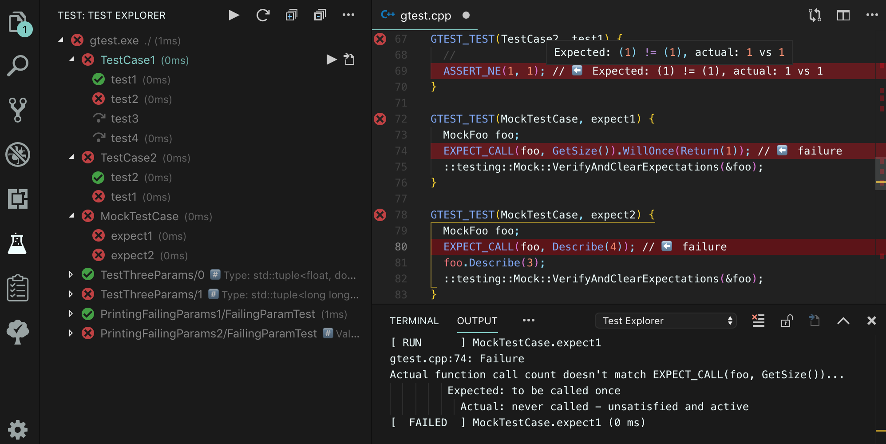
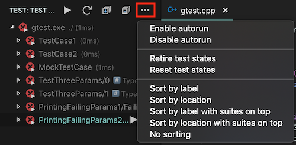

# **Catch2**, **Google Test** and **doctest** Explorer for VSCode

[](https://marketplace.visualstudio.com/items?itemName=matepek.vscode-catch2-test-adapter)
[](https://github.com/matepek/vscode-catch2-test-adapter/issues)
[](https://marketplace.visualstudio.com/items?itemName=matepek.vscode-catch2-test-adapter)

[](https://travis-ci.org/matepek/vscode-catch2-test-adapter)
[](https://ci.appveyor.com/project/matepek/vscode-catch2-test-adapter/branch/master)
[](https://github.com/matepek/vscode-catch2-test-adapter/blob/master/LICENSE)
[](https://github.com/prettier/prettier)

This extension allows you to run your [Catch2](https://github.com/catchorg/Catch2),
[Google Test](https://github.com/google/googletest)
and [doctest](https://github.com/onqtam/doctest) (experimental)
tests using the [Test Explorer for Visual Studio Code](https://marketplace.visualstudio.com/items?itemName=hbenl.vscode-test-explorer).

## Features and Screenshots

- Finds and recognises the executables by a given [glob pattern](https://code.visualstudio.com/docs/editor/codebasics#_advanced-search-options). ([More](#catch2TestExplorer_executables))
- Automatically runs executables if it is modified ("_..._" -> "_Enable autorun_") or if a dependency is modified (`dependsOn`)
- Reloads test list of an executable if it is recompiled.
- Supports popular **debuggers** such as `vadimcn.vscode-lldb`, `webfreak.debug` and `ms-vscode.cpptools` out of the box.
- Runs executables parallel (`catch2TestExplorer.workerMaxNumber`).
- Sorts tests and suites (`testExplorer.sort`).
- Cooperates with other extensions like:
  - [Test Explorer Status Bar](https://marketplace.visualstudio.com/items?itemName=connorshea.vscode-test-explorer-status-bar)
  - [Test Explorer Live Share](https://marketplace.visualstudio.com/items?itemName=hbenl.vscode-test-explorer-liveshare)




## Configuration

The extension is \*_pre-configured_ and should find executables inside the working directory which match the following [_glob pattern_](https://code.visualstudio.com/docs/editor/codebasics#_advanced-search-options):

> `{build,Build,BUILD,out,Out,OUT}/**/*{test,Test,TEST}*`.

This basically means executables inside the `build` and `out` directories (recursive `/**/`) which contain the `test` word in their name (including extensions).

(Examples [here](#Examples))

See vscode's [documentation](https://code.visualstudio.com/docs/editor/codebasics#_advanced-search-options) for syntax.

Not good enough for you?!: Edit your `.vscode/settings.json` [file](https://code.visualstudio.com/docs/getstarted/settings) according to the [examples](#Examples) bellow!

| `catch2TestExplorer.___`         | Description                                                                                                                                                                                                                                                                                                                                 |
| -------------------------------- | ------------------------------------------------------------------------------------------------------------------------------------------------------------------------------------------------------------------------------------------------------------------------------------------------------------------------------------------- |
| `executables`                    | The location of your test executables (relative to the workspace folder or absolute path) and with a lot of other setting. [Details](https://github.com/matepek/vscode-catch2-test-adapter#catch2TestExplorerexecutables)                                                                                                                   |
| `defaultCwd`                     | The working directory where the test is run (relative to the workspace folder or absolute path), if it isn't provided in "executables". (It resolves variables.)                                                                                                                                                                            |
| `defaultEnv`                     | Environment variables to be set when running the tests. (It resolves variables.)                                                                                                                                                                                                                                                            |
| `debugConfigTemplate`            | Set the necessary debug configurations and the debug button will work. [Details](https://github.com/matepek/vscode-catch2-test-adapter#catch2TestExplorerdebugConfigTemplate)                                                                                                                                                               |
| `debugBreakOnFailure`            | Debugger breaks on failure while debugging the test. Catch2: [--break](https://github.com/catchorg/Catch2/blob/master/docs/command-line.md#breaking-into-the-debugger); Google Test: [--gtest_break_on_failure](https://github.com/google/googletest/blob/master/googletest/docs/advanced.md#turning-assertion-failures-into-break-points); |
| `defaultNoThrow`                 | Skips all assertions that test that an exception is thrown, e.g. REQUIRE_THROWS. This is a Catch2 parameter: [--nothrow](https://github.com/catchorg/Catch2/blob/master/docs/command-line.md#eliding-assertions-expected-to-throw);                                                                                                         |
| `defaultRngSeed`                 | Shuffles the tests with the given random. Catch2: [--rng-seed (<integer> or 'time')](https://github.com/catchorg/Catch2/blob/master/docs/command-line.md#rng-seed); Google Test: [--gtest_random_seed=<integer>](https://github.com/google/googletest/blob/master/googletest/docs/advanced.md#shuffling-the-tests);                         |
| `defaultWatchTimeoutSec`         | Test executables are being watched (only inside the workspace directory). In case of one recompiles it will try to preserve the test states. If compilation reaches timeout it will drop the suite.                                                                                                                                         |
| `retireDebounceTimeMilisec`      | Retire events will be held back for the given duration. (Reload is required)                                                                                                                                                                                                                                                                |
| `defaultExecParsingTimeoutSec`   | The timeout duration (in seconds) of the test-executable identifier (Calls the exec with `--help`).                                                                                                                                                                                                                                         |
| `defaultRunningTimeoutSec`       | Test executable is running in a process. In case of an infinite loop, it will run forever, unless this parameter is set. It applies instantly. (0 means infinite)                                                                                                                                                                           |
| `workerMaxNumber`                | The variable maximize the number of the parallel test execution. It applies instantly.                                                                                                                                                                                                                                                      |
| `enableTestListCaching`          | (Experimental) In case your executable took too much time to list the tests, one can set this. It will preserve the output of `--gtest_list_tests --gtest_output=xml:...`. (Beware: Older Google Test doesn't support xml test list format.) (Click [here](http://bit.ly/2HFcAC6), if you think it is a useful feature!)                    |
| `logpanel`                       | Creates a new output channel and write the log messages there. For debugging. Enabling it could slow down your vscode.                                                                                                                                                                                                                      |
| `logSentry`                      | Errors/Exceptions will be logged and sent automatically for further analysis.                                                                                                                                                                                                                                                               |
| `googletest.gmockVerbose`        | Sets [--gmock_verbose=...](https://github.com/google/googletest/blob/master/googlemock/docs/cheat_sheet.md#flags). (Note: executable has to be linked to gmock `gmock_main` not `gtest_main`)                                                                                                                                               |
| `googletest.treatGmockWarningAs` | Forces the test to be failed even it is passed if it contains the string `GMOCK_WARNING:`. (You may should consider using [testing::StrictMock<T>](https://github.com/google/googletest/blob/master/googlemock/docs/cook_book.md#the-nice-the-strict-and-the-naggy-nicestrictnaggy))                                                        |

| `testExplorer.___` | [Description](https://github.com/hbenl/vscode-test-explorer#configuration)                                                                                    |
| ------------------ | ------------------------------------------------------------------------------------------------------------------------------------------------------------- |
| `errorDecoration`  | Show error messages from test failures as decorations in the editor. [Details](https://github.com/hbenl/vscode-test-explorer#configuration)                   |
| `gutterDecoration` | Show the state of each test in the editor using Gutter Decorations. [Details](https://github.com/hbenl/vscode-test-explorer#configuration)                    |
| `codeLens`         | Show a CodeLens above each test or suite for running or debugging the tests. [Details](https://github.com/hbenl/vscode-test-explorer#configuration)           |
| `onStart`          | Retire or reset all test states whenever a test run is started. [Details](https://github.com/hbenl/vscode-test-explorer#configuration)                        |
| `onReload`         | Retire or reset all test states whenever the test tree is reloaded. [Details](https://github.com/hbenl/vscode-test-explorer#configuration)                    |
| `sort`             | Sort the tests and suites by label or location. If this is not set (or set to null), they will be shown in the order that they were received from the adapter |

**Note** that this extension is built upon the Test Explorer so its
[configuration](https://github.com/hbenl/vscode-test-explorer#configuration) and [commands](https://github.com/hbenl/vscode-test-explorer#commands)
can be used.

### catch2TestExplorer.executables

The first example (`.vscode/settings.json` or hit _Ctr/Cmd + ,_):

```json
"catch2TestExplorer.executables": [
	{
		"pattern": "{build,Build,BUILD,out,Out,OUT}/**/*{test,Test,TEST}*",
		"cwd": "${absDirpath}",
		"env": {
			"ExampleENV1": "You can use variables here too, like ${relPath}",
			"PATH": "${os_env:PATH}:/adding/new/item/to/PATH/env"
		}
	}
]
```

[More examples.](#Examples)

This variable can be

- a string (ex.: `"out/**/*test.exe"`) or
- an array of strings and objects (ex.: `[ "debug/*test.exe", { "pattern": "release/*test.exe" }, ... ]`).

If it is an object it can contains the following properties:

| Property      | Description                                                                                                                                                                                                                                                                   |
| ------------- | ----------------------------------------------------------------------------------------------------------------------------------------------------------------------------------------------------------------------------------------------------------------------------- |
| `name`        | The name of the test suite (file). Can contains variables related to `pattern`.                                                                                                                                                                                               |
| `pattern`     | A relative (to workspace directory) or an absolute path or [_glob pattern_](https://code.visualstudio.com/docs/editor/codebasics#_advanced-search-options). ⚠️**Avoid backslash!**: 🚫`\`; ✅`/`; (required)                                                                  |
| `description` | A less prominent text after the `name`. Can contains variables related to `pattern`.                                                                                                                                                                                          |
| `cwd`         | The current working directory for the test executable. If it isn't provided and `defaultCwd` does, then that will be used. Can contains variables related to `pattern`.                                                                                                       |
| `env`         | Environment variables for the test executable. If it isn't provided and `defaultEnv` does, then that will be used. Can contains variables related to `pattern` and variables related to the process's environment variables (Ex.: `${os_env:PATH}`).                          |
| `dependsOn`   | Array of (relative / absolute) _paths_ / [_glob pattern_](https://code.visualstudio.com/docs/editor/codebasics#_advanced-search-options) (string[]). If a related file is _changed/created/deleted_ and autorun is enabled in "..." menu it will run the related executables. |

The `pattern` (or the `executables` used as string or an array of strings)
can contain [_search-pattern_](https://code.visualstudio.com/docs/editor/codebasics#_advanced-search-options).
Also it can contain variables related to the process's environment variables (Ex.: `${os_env:PATH}`).

Test executables and `pattern`s are being watched.
In case of one recompiles it will try to preserve the test states.
If compilation reaches timeout it will drop the suite (`catch2TestExplorer.defaultWatchTimeoutSec`).

**Note** that there is a mechanism which will filter out every possible executable which:

- on windows: NOT ends with `.exe`, `.cmd` or `.bat`.
- on other platforms: ends with one of the following:
  `'.c', '.cmake', '.cpp', '.cxx', '.deb', '.dir', '.gz', '.h', '.hpp', '.hxx', '.ko', '.log', '.o', '.php', '.rpm', '.so', '.tar', '.txt'`.

It won't filter out `'.sh'`, `'.py'` (etc.) files, so that could be used for wrappers.

If the pattern is too general like `out/**/*test*`, it could cause unexpected executable or script execution (with `--help` argument)
which would not just increase the test-loading duration but also could have other unexpected effects.
I suggest to have a stricter file-name convention and a corresponding pattern like `out/**/*.test.*` or `out/**/Test.*`

**Note** to `dependsOn`:

- ℹ️Executables found by pattern are automatically watched, don't need to add them to `dependsOn`.
- If "Enable autorun" is enabled in "**...**" menu (next to the play button), it will trigger the related test suites by detecting the recompilation of the executable.
- It accumulates events with the following strategy: waiting for 2 seconds after the last event.
- Works flawlessly with paths/patterns **inside** of the workspace directory
  (Usually there is no reason to keep your executables outside of the workspace. [See](https://github.com/matepek/vscode-catch2-test-adapter/issues/48).),
- but have some issue/limitation with paths/patterns **outside** of the workspace directory:
  - Theoretically is should support [glob patterns](https://github.com/matepek/vscode-catch2-test-adapter/issues/48),
    but it seem there is an issue with _double star_ (`**`).
  - Paths on different drive in the same `dependsOn` array maybe won't work.
  - (If you find another corner case, feel free to open an issue. It could be handy once in the future.)

#### Variables which can be used in `name`, `description`, `cwd` and `env` of `executables`:

[array index]: https://developer.mozilla.org/en-US/docs/Web/JavaScript/Reference/Global_Objects/Array/slice

| Variable                     | Description                                                                                                                                                                                  |
| ---------------------------- | -------------------------------------------------------------------------------------------------------------------------------------------------------------------------------------------- |
| `${absPath}`                 | Absolute path of the test executable. Supports [array index]ing.                                                                                                                             |
| `${relPath}`                 | Relative path of the test executable to the workspace folder. Supports [array index]ing.                                                                                                     |
| `${absDirpath}`              | Absolute path of the test executable's parent directory. Supports [array index]ing.                                                                                                          |
| `${relDirpath}`              | Relative path of the test executable's parent directory to the workspace folder. Supports [array index]ing.                                                                                  |
| `${filename}`                | Filename (Path without directories; "`d/a.b.c`" => "`a.b.c`") Supports [array index]ing.                                                                                                     |
| `${baseFilename}`            | Filename without extension ("`d/a.b.c`" => "`a.b`")                                                                                                                                          |
| `${extFilename}`             | Filename extension. ("`d/a.b.c`" => "`.c`")                                                                                                                                                  |
| `${workspaceDirectory}`      | (You can only guess once.)                                                                                                                                                                   |
| `${workspaceFolder}`         | Alias of `${workspaceDirectory}`                                                                                                                                                             |
| `${workspaceName}`           | Workspace name can be custom in case of [`workspace file`](https://code.visualstudio.com/docs/editor/multi-root-workspaces#_workspace-file-schema).                                          |
| `${name}`                    | The resolved `executables`'s name. Can be used only in `cwd` and `env`.                                                                                                                      |
| `${description}`             | The resolved `executables`'s description. Can be used only in `cwd` and `env`.                                                                                                               |
| `${cwd}`                     | The resolved `executables`'s cwd. Can be used only in `env`. Supports [array index]ing.                                                                                                      |
| `${os_env:<varname>}`        | Resolves it to the given(`<varname>`) environment variable if exists empty string otherwise. Can be used everywhere. On Windows it is case insensitive: `${os_env:pAtH}` == `${os_env:PATH}` |
| `${os_env_strict:<varname>}` | Resolves it to the given(`<varname>`) environment variable if exists won't set the variable othewise. Can be used ONLY in `env`.                                                             |

[Array index]ing: `(?:\[(-?[0-9]+)?:(-?[0-9]+)?\])?`.
Exmaple: `${relPath[:-2]}`

#### Examples:

```json
"catch2TestExplorer.executables": "dir/test.exe"
```

```json
"catch2TestExplorer.executables": ["dir/test1.exe", "dir/test2.exe"]
```

```json
"catch2TestExplorer.executables": {
	"name": "${filename}",
	"description": "${relDirpath}/",
	"pattern": "{build,Build,BUILD,out,Out,OUT}/**/*{test,Test,TEST}*",
	"cwd": "${absDirpath}",
	"env": {
		"ExampleENV1": "You can use variables here too, like ${absPath}",
		"PATH": "${os_env:PATH}:/adding/new/item/to/PATH/env"
	}
}
```

```json
"catch2TestExplorer.executables": [
	{
		"name": "Test1 suite",
		"pattern": "dir/test.exe"
	},
	"canBeMixed.exe",
	{
		"pattern": "${os_env:HOME}/dir2/{t,T}est",
		"cwd": "out/tmp",
		"env": {}
	}
]
```

### catch2TestExplorer.debugConfigTemplate

If `catch2TestExplorer.debugConfigTemplate` value is `null` (default),

> it searches for configurations in the workspacefolder's `.vscode/launch.json`.
> It will choose the first one which's `"request"` property is `"launch"`
> and has `type` property with string value starting with `cpp`, `lldb` or `gdb`.
> (If you don't want this but also don't want to specify you own debugConfigTemplate
> use `"extensionOnly"` as value.)

In case it hasn't found one it will look after:

> 1. [`vadimcn.vscode-lldb`](https://github.com/vadimcn/vscode-lldb#quick-start),
> 2. [`webfreak.debug`](https://github.com/WebFreak001/code-debug),
> 3. [`ms-vscode.cpptools`](https://github.com/Microsoft/vscode-cpptools)
>
> extensions in order. If it finds one of it, it will use it automatically.
> For further details check [VSCode launch config](https://code.visualstudio.com/docs/editor/debugging#_launch-configurations).

**Remark**: This feature to work automatically (value: `null`) has a lot of requirements which are not listed here.
If it works it is good for you.
If it isn't.. I suggest to create your own `"catch2TestExplorer.debugConfigTemplate"` template.
If you read the _Related documents_ and still have a question feel free to open an issue.
Value `"extensionOnly"` will cause to skip the search of local launch configurations.

#### or user can manually fill it

For [`vadimcn.vscode-lldb`](https://github.com/vadimcn/vscode-lldb#quick-start) add something like this to settings.json:

```json
"catch2TestExplorer.debugConfigTemplate": {
  "type": "cppdbg",
  "MIMode": "lldb",
  "program": "${exec}",
  "args": "${args}",
  "cwd": "${cwd}",
  "env": "${envObj}",
  "externalConsole": false
}
```

#### Usable variables:

| Variable name   | Value meaning                                                        | Type                       |
| --------------- | -------------------------------------------------------------------- | -------------------------- |
| `${label}`      | The name of the test. Same as in the Test Explorer.                  | string                     |
| `${suiteLabel}` | The name of parent suites of the test. Same as in the Test Explorer. | string                     |
| `${exec}`       | The path of the executable.                                          | string                     |
| `${argsArray}`  | The arguments for the executable.                                    | string[]                   |
| `${argsStr}`    | Concatenated arguments for the executable.                           | string                     |
| `${cwd}`        | The current working directory for execution.                         | string                     |
| `${envObj}`     | The environment variables as object properties.                      | { [prop: string]: string } |

These variables will be substituted when a DebugConfiguration is created.

Note that `name` and `request` are filled, if they are undefined, so it is not necessary to set them.
`type` is necessary.

#### About [Sentry.io]() integration

As a developer, you may know how valuable can be if you have some information.
The feature is disabled by default, the user is promted to enable it.
It can be enabled globally and disabled for the workspace or the other way around.
With enabling you support my work. 🙏

## License

[The Unlicense](https://choosealicense.com/licenses/unlicense/)

## Known issues

- (2018-09-03) On windows the navigate to source button isn't working. It is a framework bug.
- (2018-11-17) Catch2: Long (>80 character) filename, test-name or description can cause test-list parsing failures.
  Workaround: `#define CATCH_CONFIG_CONSOLE_WIDTH 300` and it has to be defined before every `#include "catch.hpp"` lines.
- (2019-12-27) doctest 2.3.6 is support file and line informations. Previous version will recognise the tests but navigation will be disabled.

For solving issues use: `catch2TestExplorer.logpanel: true` and check the output window.

## F.A.Q

> Wanna see the test run results in the status bar too.
>
> > Check this extension: [Test Explorer Status Bar](https://marketplace.visualstudio.com/items?itemName=connorshea.vscode-test-explorer-status-bar)

> I want to run some **custom script** before the tests (for example to set some environment variables and do some init), how should I do that?
>
> > Create command line wrapper (.sh/.bat) or a python script wrapper. The most convenient way is to generate one.
>
> Would you show me an example?
>
> > Sure! For example in case of CMake: [check this](https://github.com/matepek/vscode-catch2-test-adapter/blob/master/documents/examples/test_wrapper/cmake_test_wrapper_example/CMakeLists.txt).
> > Note: However this is the easiest, not the best solution.
> > There is a drawback: Debugging button won't work, since the debuger will attach to the script not to the executable started by the script.
>
> Is there a solution for that?
>
> > Yes. One can enhance their test executable from c++. The example is [here](https://github.com/matepek/vscode-catch2-test-adapter/tree/master/documents/examples/test_wrapper/cppmain_test_wrapper_example)

> Wanna set `cwd` to the _source file_'s dir to use the resources next to it and my structure looks like (because I use cmake):
>
> ```
> <workspaceFolder>/src/a/resources/
> <workspaceFolder>/src/a/test1.cpp
> <workspaceFolder>/build/a/test1.exe
> ```
>
> > You can try this:
> >
> > ```
> > "catch2TestExplorer.executables": [
> >   {
> >     "pattern": "build/**/test*.exe",
> >     "cwd": "${relDirpath[1:]}/resources"
> >   }
> > ]
> > ```
> >
> > This will remove the `build/` from the beggining of the relative path of the executable.

## TODOs

- doctest: supporting test suites
- Test cases: google test, catch2: info, warn, fail, stdout, stderr, capture, gtest_skip, gmock_verbose
- gaze is not good enough: detects change and delete, but not creation
- `dependsOn` could contain variables
- https://github.com/nodejs/node-gyp

## Contribution

[The guideline is here.](CONTRIBUTING.md)

[](https://www.buymeacoffee.com/rtdmjYspB)

```

```
