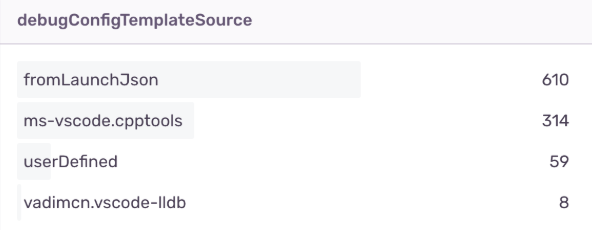
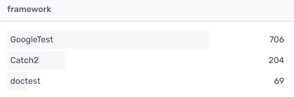

# Logging with Sentry.io

```
testMate.cpp.log.logSentry
```

As a developer, you may know how valuable can be if you have some information.
The feature is disabled by default, the user is promted to enable it.
It can be enabled globally and disabled for the workspace or the other way around.
I've already fixed several issues using it. I also know where should I put more effort.

With enabling you support my work 🙏 and you give me a hint which features should I care more about. 😉




